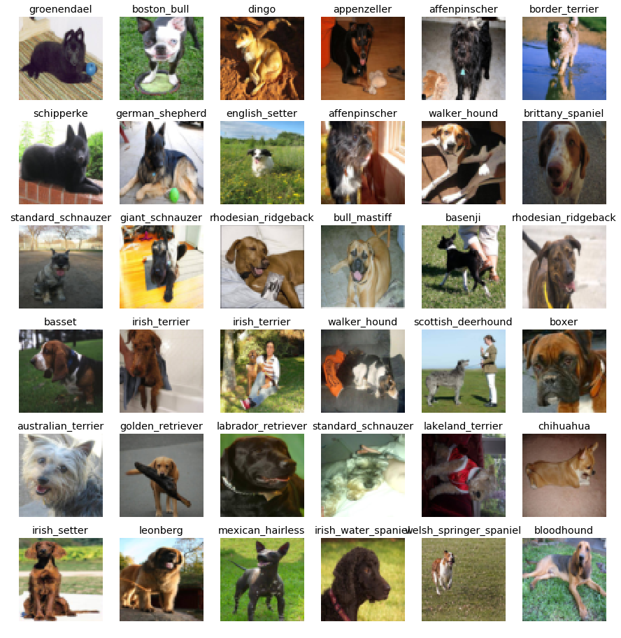
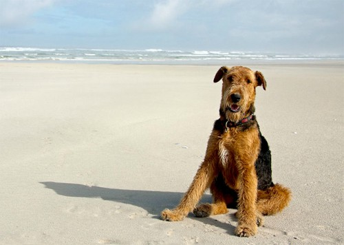
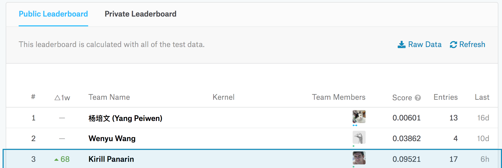

### Dog Breeds Classification

This repo is intended to contain a set of scripts and data for reproducing dog breed classification model training, analysis, and inference.

#### Usage
 
This section describes how to build dog breed classification dense neural network model on top of the pre-trained by Google deep neural network (namely Inception model).

1. `cd` to this repo root directory.
2. Create all required directories: `sh ./create_dirs.sh`
3. Download Google Inception model: `sh ./inception_download.sh`. The link to the frozen TensorFlow model is taken from [here](https://github.com/tensorflow/models/blob/master/tutorials/image/imagenet/classify_image.py#L51)
4. Download [Stanford Dogs Dataset](http://vision.stanford.edu/aditya86/ImageNetDogs/): `sh ./download_stanford_dogs_dataset.sh` 
5. Install all required python dependencies: `pip install -r requirements.txt`
6. Convert downloaded Stanford Dogs Dataset to TensorFlow friendly [TFRecords](https://www.tensorflow.org/programmers_guide/datasets#consuming_tfrecord_data) file: `python stanford_ds_to_tfrecords.py`
7. Give a name to the model your are going to train by assigning a name to `CURRENT_MODEL_NAME` variable in [consts.py](consts.py#L14) script
8. Configure number of layers and number of units in each layer by setting `HEAD_MODEL_LAYERS` variable in [consts.py](consts.py#18)
9. Train the model: `python train.py`. It might take 30-50 minutes depending on the depth of your model and number of epochs (which could be configured in the train.py script itself). TensorBoard could be used to observe the training process: `tensorboard --logdir=./summary`
10. Freeze the model: `python freeze.py`. This will bind Inception model with the trained on the previous step "head" model and serialize it as a TensorFlow graph with variables represented as constants. This frozen model will be ready to use for classification tasks.
11. Produce CSV file with predicted vs actual breed. This could be used to analyze precision on the training data e.g. plot a confusion matrix (see [Confusion.ipynb](Confusion.ipynb)). Result CSV file goes to `metrics/training_confusion.csv`
12. Use the model frozen on the previous step to classify an image either available on the filesystem or downloadable as an HTTP resource: `python classify.py uri http://cdn1-www.dogtime.com/assets/uploads/gallery/shih-tzu-dog-breed-pictures/shih-tzu-breed-picture-6.jpg` `python classify.py file images/airedale.jpg`. In my case the model was training for 25 mins (5000 epochs) and the following sample classification outputs were produced:
 
 
 
 (Image is taken from [http://dogtime.com/dog-breeds/airedale-terrier](http://dogtime.com/dog-breeds/airedale-terrier))

| breed | probability |
| ------ | ------ |
| airedale | 0.992064 |
| otterhound | 0.005108 |
| chesapeake_bay_retriever | 0.001259 |
| irish_terrier | 0.000635 |
| wire-haired_fox_terrier | 0.000378 |

(Image is taken from [http://dogtime.com/dog-breeds/shih-tzu](http://dogtime.com/dog-breeds/shih-tzu#/slide/1))

| breed | probability |
| ------ | ------ |
|        shih-tzu | 0.752834 |
|           lhasa | 0.234748 |
| tibetan_terrier | 0.007598 |
|     maltese_dog | 0.000969 |
|japanese_spaniel | 0.000936 |

13. Have a fun!

#### Kagle Dog Breed Classification Competition

This model ranked #3 in the [Kaggle's Dog Breed Classification Challenge](https://www.kaggle.com/c/dog-breed-identification). 

